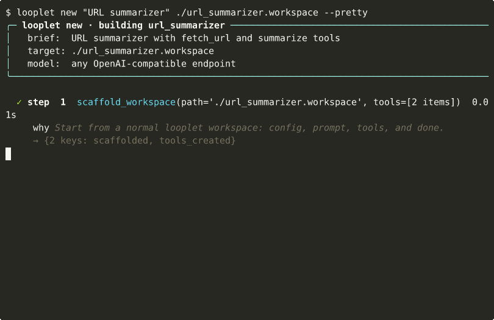
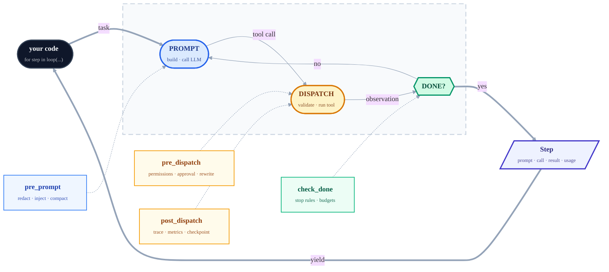

# looplet



[](https://github.com/hsaghir/looplet/actions/workflows/ci.yml)
[](https://codecov.io/gh/hsaghir/looplet)
[](https://pypi.org/project/looplet/)
[](https://www.python.org/downloads/)
[](LICENSE)

**Describe an agent in one paragraph. Get a working agent in five minutes.**

```bash
pip install looplet
export OPENAI_BASE_URL=https://api.openai.com/v1   # any OpenAI-compatible endpoint
export OPENAI_API_KEY=sk-...
export OPENAI_MODEL=gpt-5.5

looplet new "An agent that takes a URL and returns the page title and a 2-sentence summary"
looplet run-workspace ./agent.cartridge "Summarize https://example.com"
```

The recording above is a deterministic `--pretty` trace of that same CLI flow: build an agent cartridge, then run it against a real task. The real factory path uses the same commands; the recorded trace is scripted so the docs stay stable and tiny.

**Mention an existing CLI, Python module, or script in your brief, and the factory wraps it.** Your team's tools already exist; looplet introspects the real surface and writes thin wrappers around them — no hallucinated signatures.

```bash
# Wrap the gh CLI as a triage agent
looplet new "Wrap the gh CLI as a triage agent that surfaces my open PRs and issues"

# Wrap an existing Python class as agent tools
looplet new "Wrap mycompany.search:SearchClient as a SOC investigator with search/pivot/scan tools"
```

See [docs/agent-factory.md](docs/agent-factory.md) for the full pattern.

---

## Why looplet

Most agent frameworks give you `agent.run(task)` — a black box. When the agent does something wrong at step 7, you can't step in between step 6 and step 8.

**Looplet does the opposite: the loop is the product.** Every step is a `Step` object you can inspect, save, or diff. Every decision the loop makes — what goes in the next prompt, whether to compact context, whether to dispatch a dangerous tool, whether to stop — is a `Protocol` method you implement in a few lines. Hooks compose without inheritance. Nothing is hidden.

Agents are **data**. A cartridge is a directory of files (`cartridge.json`, `config.yaml`, `prompts/system.md`, `tools/<name>/{tool.yaml, execute.py}`) that the loader materialises into a runnable agent. The factory builds new cartridges from English briefs; the loop engine runs them. **Zero runtime dependencies.**

---

## The mental model — one picture



Every amber box is a `Protocol` method. A hook is any object that implements one or more — no base class, no inheritance:

```python
class RedactPII:
    def pre_prompt(self, state, log, ctx, step):
        return _scrub_emails(ctx)         # mutates the next LLM prompt

class RetryFlakyTool:
    def pre_dispatch(self, state, log, tc, step):
        if tc.tool == "web_search" and state.last_error:
            return Deny("retry with backoff", retry=True)

for step in composable_loop(..., hooks=[RedactPII(), RetryFlakyTool()]):
    ...
```

Ship-ready hooks already wired in: `ApprovalHook`, `PermissionHook`, `CheckpointHook`, `ContextPressureHook`, `ThresholdCompactHook`, `ProvenanceSink`, `TracingHook`, `MetricsHook`, `EvalHook`, plus `DefaultCompactService` for production context management. [Drop in your own](docs/hooks.md) in 10 lines.

---

## Three ways to use it

### 1. Generate an agent from a brief

```bash
looplet new "<one paragraph>" ./my_agent.cartridge
looplet run-workspace ./my_agent.cartridge "<task>"
```

The factory writes `cartridge.json`, `config.yaml`, `prompts/system.md`, and one `tools/<name>/` directory per tool the agent picks. See [docs/agent-factory.md](docs/agent-factory.md).

### 2. Hand-write the loop in Python

```python
from looplet import composable_loop, cartridge_to_preset

preset = cartridge_to_preset("./my_agent.cartridge")

for step in composable_loop(
    llm=preset.llm, config=preset.config, tools=preset.tools,
    state=preset.state, hooks=preset.hooks,
    task={"goal": "Summarize https://example.com"},
):
    print(step.pretty())
```

`composable_loop` is a generator — break out at any point, plug in your own hooks, swap context strategy. See [docs/tutorial.md](docs/tutorial.md).

### 3. Skip the cartridge entirely

```python
from looplet import BaseToolRegistry, OpenAIBackend, composable_loop
from looplet.tools import register_done_tool

llm = OpenAIBackend.from_env(model="gpt-5.5")
tools = BaseToolRegistry()

@tools.tool
def greet(name: str) -> dict:
    """Greet someone by name."""
    return {"greeting": f"Hello, {name}!"}

register_done_tool(tools)

for step in composable_loop(llm=llm, tools=tools, task={"goal": "Greet Alice and Bob, then finish."}, max_steps=5):
    print(step.pretty())
```

Required env vars (any OpenAI-compatible endpoint — OpenAI, Ollama, Together, Groq, vLLM, Anthropic via proxy):

| Var | Example |
|---|---|
| `OPENAI_BASE_URL` | `https://api.openai.com/v1` |
| `OPENAI_API_KEY` | `sk-…` |
| `OPENAI_MODEL` | `gpt-5.5`, `claude-sonnet-4.6`, `llama3.1` |

Run `looplet doctor` to verify connectivity.

---

## When to reach for looplet

**Use it when you want to own the details of your agent loop.** Specifically:

- You need to insert logic at an exact phase — before the prompt, before a tool dispatch, after a tool returns — without forking a framework.
- You need to swap context-management strategy at runtime (prune, summarize, truncate, your own).
- You need the loop to pause for human approval and resume when approval arrives.
- You want first-class debugging and evaluation: a printable `Step`, a prompt-level provenance dump, pytest-style `eval_*` functions.
- You want zero runtime dependencies and a loop that cold-imports in ~300 ms ([docs/benchmarks.md](docs/benchmarks.md)).

**Don't reach for looplet** if you want `agent.run(task)` to handle everything and return a string, or if you want a visual graph DSL.

---

## Examples

Five fully-declarative cartridges ship in `examples/`:

| Workspace | What it does |
|---|---|
| [`hello.cartridge`](examples/hello.cartridge/) | Two-tool starter; load and run with any backend |
| [`coder.cartridge`](examples/coder.cartridge/) | Coding agent — bash, read, write, edit, grep, glob |
| [`dep_doctor.cartridge`](examples/dep_doctor.cartridge/) | Audits a repo's dependency files for security/license/maintenance risk |
| [`git_detective.cartridge`](examples/git_detective.cartridge/) | Investigates repo health from git history |
| [`threat_intel.cartridge`](examples/threat_intel.cartridge/) | Local-first security briefings |

> **Four tools is usually enough.** `coder.cartridge` ships with
> `bash`, `read`, `write`, `edit` — the same four that
> [Pi](https://github.com/earendil-works/pi) used to rank #2 on
> TerminalBench. `grep` and `glob` are convenience wrappers over
> `bash`; you can drop them and the agent still works. Resist the
> urge to add a tool until the model demonstrably can't accomplish
> the task with the four it has.

Load any of them:

```python
from looplet import cartridge_to_preset, composable_loop
preset = cartridge_to_preset("examples/dep_doctor.cartridge", runtime={"workspace": "/path/to/project"})
for step in composable_loop(llm=preset.llm, config=preset.config, tools=preset.tools, state=preset.state, hooks=preset.hooks, task={"goal": "Audit dependencies"}):
    print(step.pretty())
```

Or use them as a starting point: `cp -r examples/coder.cartridge ./my_agent.cartridge`, then edit. Each cartridge round-trips losslessly with an `AgentPreset` via `preset_to_cartridge` / `cartridge_to_preset`.

---

## Learn more

| Doc | What's in it |
|---|---|
| [**docs/agent-factory.md**](docs/agent-factory.md) | **`looplet new` — generate agents from English briefs (start here)** |
| [docs/tutorial.md](docs/tutorial.md) | Hand-write your first agent in 5 steps |
| [docs/cartridge.md](docs/cartridge.md) | Workspace file layout reference |
| [docs/hooks.md](docs/hooks.md) | Writing and composing hooks |
| [docs/evals.md](docs/evals.md) | pytest-style agent evaluation |
| [docs/provenance.md](docs/provenance.md) | Capturing prompts + trajectories |
| [docs/recipes.md](docs/recipes.md) | Ollama, OTel, MCP, cost accounting, checkpoints |
| [docs/benchmarks.md](docs/benchmarks.md) | Cold-import time & dep footprint |
| [docs/faq.md](docs/faq.md) | FAQ, including "why not LangGraph?" |
| [ROADMAP.md](ROADMAP.md) | What's planned, what's frozen, what's out of scope |
| [CONTRIBUTING.md](CONTRIBUTING.md) | Dev setup, conventions, PR checklist |
| [CHANGELOG.md](CHANGELOG.md) | Release notes |

---

## Stability

`looplet` follows [SemVer](https://semver.org/). Pre-`1.0`, minor versions may introduce breaking changes — pin conservatively:

```toml
looplet>=0.1.8,<0.2
```

See [ROADMAP.md § v1.0 API contract](ROADMAP.md#v10-api-contract) for the frozen surface and the path to `1.0`.

---

## Contributing

Bug reports, docs, backends, examples, evals all welcome. See [CONTRIBUTING.md](CONTRIBUTING.md) for dev setup and conventions; browse [open issues labelled `good first issue`](https://github.com/hsaghir/looplet/issues?q=is%3Aopen+label%3A%22good+first+issue%22) for scoped tasks. Security issues go through [SECURITY.md](SECURITY.md).

Thanks to everyone who has contributed:

- [@mvanhorn](https://github.com/mvanhorn) — "Why not LangGraph?" FAQ (#17)

## License

Apache 2.0. See [LICENSE](LICENSE).
