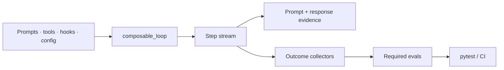

# looplet

[](https://github.com/hsaghir/looplet/actions/workflows/ci.yml)
[](https://codecov.io/gh/hsaghir/looplet)
[](https://pypi.org/project/looplet/)
[](https://www.python.org/downloads/)
[](https://github.com/hsaghir/looplet/blob/master/LICENSE)

**Test-driven harness engineering for Python agents.**

## Own the loop. Test every change.

Looplet is for teams building a tool-calling agent that is fundamentally
one model in one loop. It is for the point when prompts, tools, hooks, memory,
or models must change without guessing what behavior broke.

Keep the harness in reviewable files. Capture what the model saw. Replay
recorded responses against fresh harness code. Grade independently
observed outcomes and gate them in pytest or CI. No graph DSL, hosted
control plane, or required third-party runtime dependencies.



[Documentation](https://hsaghir.github.io/looplet/) ·
[Why Looplet](https://hsaghir.github.io/looplet/why-looplet/) ·
[Failure → regression proof](https://hsaghir.github.io/looplet/regression-demo/) ·
[Evals](https://hsaghir.github.io/looplet/evals/)

---

## See a failed run become a regression test

Clone the repository and run the network-free proof:

```bash
uv sync
uv run python examples/regression_demo/run_demo.py
```

```text
1. CAPTURE v1 with fixed model responses
   model decisions: publish_report -> done
   collected profit: 200
   required eval: FAIL (0.00)

2. CHANGE one reviewable harness line
   - "profit": revenue + cost,
   + "profit": revenue - cost,

3. REPLAY captured responses with fresh v2 tool execution
   same decisions: true
   collected profit: 40
   required eval: PASS (1.00)
```

The demo persists both harness versions, the captured model-call
cassette, fresh workspaces, trajectories, host-observed artifacts, and
grader results. The model decisions stay fixed; the changed tool code
executes again.

> **Replay is controlled re-execution, not deterministic simulation.**
> Captured model responses are held constant. Tools, clocks, networks, and other
> side effects are fresh unless you isolate or mock them.

Read the [walkthrough](https://hsaghir.github.io/looplet/regression-demo/) or inspect the
[source](https://github.com/hsaghir/looplet/tree/master/examples/regression_demo).

---

## The post-prototype workflow

Most agent prototypes start as a while-loop plus tools. Keep that if it
is enough. Reach for Looplet when the next prompt or tool change needs
evidence:

1. **Build** the harness in Python or a file-native cartridge.
2. **Run** an iterator that yields every tool call as a `Step`.
3. **Capture** prompts, responses, steps, and stop reasons to readable files.
4. **Replay** captured responses through changed tools, hooks, state, or permissions.
5. **Collect** actual world state after the run.
6. **Gate** the behavior with required, outcome-grounded evals.

The same primitives work online during development, offline against
saved trajectories, and inside pytest or a CI CLI.

## Start with one owned loop

```bash
pip install "looplet[openai]"

export OPENAI_BASE_URL=https://api.openai.com/v1
export OPENAI_API_KEY=...
export OPENAI_MODEL=...
```

```python
from looplet import OpenAIBackend, composable_loop, tool, tools_from


@tool(description="Look up one fact by key.")
def lookup(key: str) -> dict:
    return {"key": key, "value": {"owner": "platform"}.get(key)}


llm = OpenAIBackend.from_env()
tools = tools_from([lookup], include_done=True)

for step in composable_loop(
    llm=llm,
    tools=tools,
    task={"goal": "Find the owner, then finish."},
    max_steps=5,
):
    print(step.pretty())
```

`composable_loop()` is a generator. Your code owns iteration and can
log, approve, route, pause, or stop at the exact tool boundary. Hooks
are duck-typed Python objects; implement only the lifecycle methods you
need.

For a zero-network first run:

```bash
python -m looplet.examples.hello_world --scripted
```

Continue with the [quickstart](https://hsaghir.github.io/looplet/quickstart/).

---

## Make the harness a reviewable artifact

A cartridge is an optional directory representation of the runnable
harness:

```text
agent.cartridge/
├── cartridge.json
├── config.yaml
├── runtime.yaml
├── prompts/system.md
├── tools/<name>/{tool.yaml, execute.py}
├── hooks/<order>_<name>/{config.yaml, hook.py}
├── resources/<name>.py
├── memory/*.md
└── evals/
    ├── cases/*.json
    ├── collect_*.py
    └── eval_*.py
```

Inspect and compare it without running a model:

```bash
looplet describe ./agent.cartridge
looplet diff ./agent-v1.cartridge ./agent-v2.cartridge --show
looplet hash ./agent.cartridge
looplet eval run ./agent.cartridge --out ./eval-runs --threshold 1.0
```

The prompt, tool, hook, and self-test change live next to the behavioral
contract they affect. A promotion holdout belongs in a separate host-owned
runner and requires an isolation boundary outside candidate authority.

See the [cartridge guide](https://hsaghir.github.io/looplet/cartridge/). If a brief is a useful
starting point, `looplet new` can scaffold a cartridge. The
[agent factory](https://hsaghir.github.io/looplet/agent-factory/) is onboarding, not the product
boundary, so review and test what it writes.

---

## Four pieces, one narrow job

| Piece | What it provides |
| --- | --- |
| `composable_loop()` | Sync/async iterator-first execution with explicit `Step` records |
| Hooks and protocols | Exact interception points for context, permissions, approvals, compaction, tracing, and stop rules |
| Provenance + replay | Human-readable model/step evidence and captured-response re-execution |
| Collectors + evals | Host-observed artifacts, grader-only expectations, pytest helpers, and CI exit codes |

Core Looplet uses the Python standard library. OpenAI and Anthropic
SDKs are optional extras; bring your own backend if you prefer.

## Outcome-grounded by default

Do not permanently require the model to follow yesterday's trajectory
just because yesterday's model did. A smarter model may use different
tools and still produce a better result.

```python
def collect_tests(state):
    result = subprocess.run(["pytest", "-q"], check=False)
    return {"tests_passing": result.returncode == 0}


@eval_mark("required")
def eval_tests_pass(ctx):
    return ctx.artifacts["tests_passing"]
```

Use trajectory assertions to test harness mechanics, such as whether a guard
fired, a dangerous call was denied, or a stop reason was recorded. Use
collectors for product quality: tests passing, files correct, records
written, APIs healthy, or schemas valid.

The live task never includes top-level case `expected` data. Persisted runs
keep it in a separate `expected.json`. Cartridge evals remain editable
self-tests; a promotion oracle must stay in a host-owned runner and out of the
candidate task, runtime, resources, tools, and writable files. Arbitrary
candidate code requires OS or process isolation.

Read [behavioral evals](https://hsaghir.github.io/looplet/evals/).

---

## When Looplet fits

Use Looplet when:

- one model calls tools until it is done;
- your team already works in Python, Git, pytest, and CI;
- prompt, model, tool, or hook changes need regression evidence;
- you need to intercept exact phases without subclassing a framework;
- local, inspectable artifacts matter more than a hosted dashboard.

Use something else when:

- the system is naturally a branching, durable multi-stage graph;
- a managed control plane or annotation UI should be the source of truth;
- you want a turnkey assistant rather than a toolkit;
- you do not want to own execution, tools, or behavioral contracts.

Looplet can run inside a workflow engine and export to observability
services. It does not try to become either one. See the
[selection guide](https://hsaghir.github.io/looplet/why-looplet/) and [FAQ](https://hsaghir.github.io/looplet/faq/).

## Shipped examples

- [`coder.cartridge`](https://github.com/hsaghir/looplet/tree/master/examples/coder.cartridge): tool-heavy coding harness with colocated cases, collectors, and required graders.
- [`dep_doctor.cartridge`](https://github.com/hsaghir/looplet/tree/master/examples/dep_doctor.cartridge): repository dependency audit.
- [`git_detective.cartridge`](https://github.com/hsaghir/looplet/tree/master/examples/git_detective.cartridge): repository-health investigation.
- [`threat_intel.cartridge`](https://github.com/hsaghir/looplet/tree/master/examples/threat_intel.cartridge): local-first security briefing.
- [`planner.cartridge`](https://github.com/hsaghir/looplet/tree/master/examples/planner.cartridge): planning composed as a subagent, not a loop phase.
- [`regression_demo`](https://github.com/hsaghir/looplet/tree/master/examples/regression_demo): scripted, network-free captured-response replay and eval proof.

Portable twins demonstrate MCP/LEP boundaries where needed; see
[portability](https://hsaghir.github.io/looplet/portability/) for the exact supported tiers rather
than a blanket runtime-agnostic claim.

## Documentation

| Start here | Purpose |
| --- | --- |
| [Why Looplet](https://hsaghir.github.io/looplet/why-looplet/) | Category, fit, tradeoffs, and boundaries |
| [Quickstart](https://hsaghir.github.io/looplet/quickstart/) | Build, capture, and test a first loop |
| [Failure → regression](https://hsaghir.github.io/looplet/regression-demo/) | Run the core claim without a model or network |
| [Cartridges](https://hsaghir.github.io/looplet/cartridge/) | Reviewable harness layout and round-trip behavior |
| [Provenance](https://hsaghir.github.io/looplet/provenance/) | Capture and captured-response replay |
| [Evals](https://hsaghir.github.io/looplet/evals/) | Outcome collectors, grader-only data, trust boundaries, pytest, and CI |
| [Hooks](https://hsaghir.github.io/looplet/hooks/) | Lifecycle interception and composition |
| [FAQ](https://hsaghir.github.io/looplet/faq/) | Selection guidance and honest limitations |
| [Roadmap](https://github.com/hsaghir/looplet/blob/master/ROADMAP.md) | Core boundaries and explicit non-goals |

## Stability

Looplet follows SemVer. Before `1.0`, minor versions may make breaking
changes; pin to the current minor line:

```toml
looplet>=0.3,<0.4
```

The next launch release is `0.3.0`. See the
[changelog](https://github.com/hsaghir/looplet/blob/master/CHANGELOG.md) and
[path to 1.0](https://github.com/hsaghir/looplet/blob/master/ROADMAP.md#path-to-10).

## Contributing

Bug reports, focused examples, backend adapters, and integrity fixes are
welcome. New core features must be domain-agnostic, composable, and
justify why existing hooks, tools, or host code cannot express them.

See [CONTRIBUTING.md](https://github.com/hsaghir/looplet/blob/master/CONTRIBUTING.md).
Security issues go through
[SECURITY.md](https://github.com/hsaghir/looplet/blob/master/SECURITY.md).

## License

Apache License 2.0. See [LICENSE](https://github.com/hsaghir/looplet/blob/master/LICENSE).
