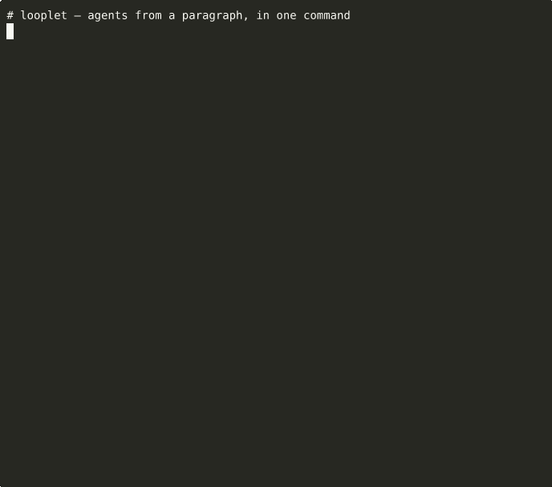

# The agent factory

Looplet's killer feature: describe the agent you want in one
paragraph, get a working workspace back in a few minutes. The factory
is built on the same primitives ([`extends:`](workspace.md#extends),
[`builtin_tools:`](workspace.md#builtin-tools),
[`scaffold_workspace`](#scaffold_workspace)) you'd use to hand-roll an
agent — it's just an agent that builds other agents.



---

## Three commands

```bash
# 1. Configure any OpenAI-compatible endpoint.
export OPENAI_BASE_URL=https://api.openai.com/v1   # or http://127.0.0.1:11434/v1 for Ollama, etc.
export OPENAI_API_KEY=sk-...
export OPENAI_MODEL=gpt-4o-mini                    # or claude-sonnet-4.6, llama3.1, …

# 2. Generate the agent.
looplet new "an agent that takes a URL and returns the page title and a 2-sentence summary" \
    ./url_summarizer.workspace

# 3. Run it on a real task.
looplet run-workspace ./url_summarizer.workspace "Summarize https://example.com"
```

That's the entire user-facing API. No Python code required to get a
working agent.

---

## What the factory writes

For each `looplet new` invocation, the produced workspace contains:

```
my_agent.workspace/
├── workspace.json          # {"name": "my_agent", "schema_version": 1}
├── config.yaml             # max_steps, max_tokens, temperature, done_tool
├── prompts/system.md       # role + tools + workflow + when to call done
├── tools/<name>/
│   ├── tool.yaml           # name, description, parameters, requires
│   └── execute.py          # def execute(ctx, *, ...) -> dict
├── tools/done/             # standard finalizer (always present)
└── tests/test_<name>.py    # at least one content assertion per pure-Python tool
```

The factory also writes one or more `tests/test_<agent>.py` files
that run during the build to verify the agent loads cleanly and
produces correctly-formatted output.

---

## CLI reference

### `looplet new <description> [target]`

Generate a workspace from a brief.

| Flag | Default | Purpose |
|---|---|---|
| `target` (positional) | `./agent.workspace` | Where to write the produced workspace |
| `--name` | derived from `target` | Workspace name (becomes `workspace.json.name`) |
| `--tool TOOL` | _(none)_ | Pre-scaffold a tool by name (repeatable). When omitted, the agent picks tools from the brief. |
| `--max-steps N` | `80` | Override the factory's max steps |
| `--quiet` | _(off)_ | Suppress per-step output |

When `--tool` is supplied, the factory's setup.py pre-scaffolds the
skeleton (saves ~5 LLM turns). Otherwise the agent reads your brief
and picks the tool list itself.

### `looplet run-workspace <path> <task>`

Load a workspace and run it on a task.

| Flag | Default | Purpose |
|---|---|---|
| `--max-steps N` | from workspace's `config.yaml` | Override |
| `--quiet` | _(off)_ | Suppress per-step output |

---

## Wrapping existing tools and data (the killer use case)

Most useful agents aren't built on greenfield Python — they're built on tools and data the team already has: an internal CLI, a vendor SDK, a helper module, a shell script. Naming any of these in the brief makes the factory introspect the real surface and write thin wrappers, instead of hallucinating signatures from training data.

The factory's planning phase recognises three patterns and uses bash + `inspect` to ground itself in the real source:

| Pattern in the brief | What the factory does |
|---|---|
| Mentions a CLI on `$PATH` (e.g. `gh`, `kubectl`, `aws`, an internal CLI) | Runs `<cli> --help` and a couple of `<cli> <subcommand> --help` calls; detects `--json` support; writes subprocess-based tool bodies that call the real subcommands |
| Mentions a Python dotted path (`pkg.module` or `pkg.module:Class`) | Imports it, runs `inspect.signature` on the public callables, and writes tool bodies that call the real methods. For class wraps it uses the workspace `resources/` mechanism: `resources/<name>.py` builds the singleton, every tool declares `requires: [<name>]`, the body looks it up via `ctx.resources["<name>"]` |
| Mentions a local script (`./scripts/foo.sh`, `~/bin/bar.py`) | Reads the file and writes a subprocess- or import-based wrapper from the actual source |

### Example: wrap the GitHub CLI

```bash
looplet new "Wrap the gh CLI as a triage agent that surfaces my open PRs and issues that need attention today" \
    ./gh_triager.workspace
```

Produces tools like:

```python
# tools/list_my_prs/execute.py
import json, subprocess

def execute(ctx, *, limit: int = 20) -> dict:
    result = subprocess.run(
        ["gh", "pr", "list", "--author", "@me", "--state", "open",
         "--limit", str(limit), "--json",
         "number,title,repository,updatedAt,reviewDecision,isDraft,url"],
        capture_output=True, text=True, check=True,
    )
    return {"prs": json.loads(result.stdout)}
```

The agent picked the right `--json` field set and the right `--author @me` flag because it ran `gh pr list --help` first.

### Example: wrap an existing Python class

```bash
looplet new "Wrap mycompany.search:SearchClient as a SOC investigator with search/pivot/scan tools, backed by DuckDBBackend(':memory:')" \
    ./soc_investigator.workspace
```

Produces a workspace with the `resources/` mechanism wired correctly:

```python
# resources/searchclient.py
from mycompany.search import SearchClient
from mycompany.backends.duckdb_backend import DuckDBBackend

def build():
    return SearchClient(DuckDBBackend(":memory:"))
```

```yaml
# tools/search/tool.yaml
name: search
parameters:
  pattern: { type: string }
  window: { type: array, default: null }
  tables: { type: array, default: null }
requires:
  - searchclient
```

```python
# tools/search/execute.py
def execute(ctx, *, pattern, window=None, tables=None) -> dict:
    ep = ctx.resources["searchclient"]
    hits = ep.search(pattern, window=window, tables=tables)
    return {"hits": [h.__dict__ for h in hits], "count": len(hits)}
```

Every signature matches the real class — including default values like `mode="full"` and `profile_top_k=10` — because the factory ran `inspect.signature` first.

### Why this works without flags

The factory's system prompt tells the agent to introspect *first* (before scaffolding) whenever the brief mentions an existing CLI / module / script. The agent has `bash`, `read_file`, and `multi_edit` tools already; a one-line `bash("python -c 'import inspect; ...'")` is all the introspection it needs. There is no special CLI flag — naming the thing in the brief is enough.

If the brief is purely greenfield ("an agent that takes a URL and returns the title…"), the factory falls through to ordinary scaffold-and-fill behaviour. The introspection step only fires when there's something concrete to wrap.

---

## What the factory does internally

`agent_factory.workspace` is a workspace itself — see
`examples/agent_factory.workspace/`. It [`extends:`](workspace.md#extends)
the bundled `coder.workspace`, so it inherits all coding tools
(`read_file`, `write_file`, `multi_edit`, `bash`, `grep`, `glob`,
`list_dir`, `think`) and adds two factory-specific tools:

* **`scaffold_workspace`** — a built-in tool that calls the
  Python helper `looplet.scaffold.scaffold_workspace()` to write
  the workspace skeleton in one step. The factory's prompt
  instructs the agent to call this FIRST so it skips the
  boilerplate of writing `workspace.json` etc. by hand.
* **`validate_workspace`** — runs `workspace_to_preset()` on the
  produced path and returns a structured success/error.

The factory's system prompt includes "robustness rules" that get
embedded in the produced agent's own system prompt:

1. **Tolerant JSON parsing.** Tools that ask the LLM for JSON
   should use a defensive `_extract_json()` helper that handles
   prose-wrapped or fenced output.
2. **Chained-tool data piping.** When the workflow chains tools,
   the second tool's args MUST come from the first tool's actual
   result. The prompt includes a worked example showing the
   fabrication failure mode and the right pattern.
3. **Defensive arg shapes.** Tools that consume another tool's
   list output should defensively unwrap a `dict` with the same
   key.

These rules make the produced agents reliable enough to ship.

---

## Pre-scaffold from the host

If you already know what tools the agent should have (e.g. when
calling the factory programmatically from a CLI you're building on
top of looplet), you can pre-scaffold the skeleton via runtime
kwargs. The factory's setup.py honours these:

```python
from looplet import workspace_to_preset, composable_loop
from looplet.types import DefaultState

preset = workspace_to_preset(
    "examples/agent_factory.workspace",
    runtime={
        "workspace": "/path/to/your/project",
        "scaffold_to": "my_agent.workspace",
        "scaffold_name": "my_agent",
        "scaffold_tools": ["fetch_url", "extract_title", "summarize_text"],
    },
)
```

This is exactly what `looplet new --tool fetch_url --tool extract_title …`
does under the hood.

---

## Quality

The factory has been dogfood-tested on five distinct briefs:

| Agent | Tools | Verdict |
|---|---|---|
| `meeting_notes` | extract_decisions, extract_action_items, format_minutes | A — correct minutes from real transcripts |
| `recipe_finder` | brainstorm_recipes, pick_best | A — pipes real recipes through correctly |
| `haiku_writer` | brainstorm_imagery, compose_haiku | A — on-topic 5-7-5 haiku |
| `json_validator` | parse_json, check_required_fields, format_report | A — correct missing-field detection |
| `git_release_notes` | fetch_commits, group_by_type, format_notes | A — real commit shas, no fabrication |

All five reach `done` end-to-end on real LLM input and produce
correct, well-formatted output.

---

## See also

- [Workspace format](workspace.md) — what's in a workspace dir
- [Composition with `extends:`](workspace.md#extends) — how the factory inherits coder.workspace
- [Built-in tools](workspace.md#builtin-tools) — `subagent`, `scaffold_workspace`
