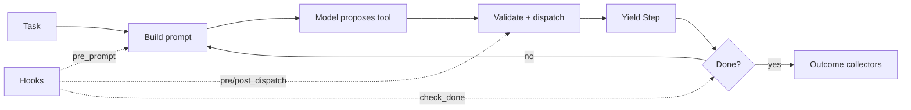

---
hide:
  - navigation
  - toc
---

<div class="hero" markdown>

<p class="hero-eyebrow">Test-driven harness engineering for Python agents</p>

# Own the loop. Test every change.

<p class="hero-sub" markdown>
Looplet keeps prompts, tools, hooks, memory, and evals in reviewable
files. Capture what the model saw, replay recorded responses against
fresh harness code, and gate changes with outcome-based pytest evals.
No graph DSL or hosted platform is required.
</p>

<p class="hero-badges" markdown>
[](https://pypi.org/project/looplet/)
[](https://pypi.org/project/looplet/)
[](https://github.com/hsaghir/looplet/blob/master/LICENSE)
[](https://github.com/hsaghir/looplet/actions)
</p>

<div class="hero-cta">
  <a href="regression-demo/" class="md-button md-button--primary">See a failed run become a regression test</a>
  <a href="quickstart/" class="md-button">Build your first harness</a>
  <a href="https://github.com/hsaghir/looplet" class="md-button">GitHub</a>
</div>

</div>

<div class="proof-strip" markdown>

<div class="proof-item" markdown>
**Reviewable**

Prompts, tools, hooks, cases, and graders are files.
</div>

<div class="proof-item" markdown>
**Observable**

Every model call and tool dispatch can become durable evidence.
</div>

<div class="proof-item" markdown>
**Re-executable**

Captured responses can drive fresh harness code without another model call.
</div>

<div class="proof-item" markdown>
**Gateable**

Host-observed outcomes become required pytest and CI contracts.
</div>

</div>

<div class="proof-terminal" markdown>

<div class="proof-terminal__title">$ uv run python examples/regression_demo/run_demo.py</div>

```text
1. CAPTURE v1 with fixed model responses
   model decisions: publish_report -> done
   collected profit: 200
   required eval: FAIL (0.00)

2. CHANGE one reviewable harness line
   - "profit": revenue + cost,
   + "profit": revenue - cost,

3. REPLAY captured responses with fresh v2 tool execution
   same decisions: true
   collected profit: 40
   required eval: PASS (1.00)
```

</div>

<p class="proof-caption" markdown>
No API key. No network. One captured model decision stream, one fresh
tool execution, one independently collected outcome. [Read exactly
what the demo proves and what it does not.](regression-demo.md)
</p>

---

## The problem starts after the prototype

Your agent runs. Then the harness starts moving:

- a prompt edit fixes one case and silently breaks another;
- a model upgrade chooses a different path;
- a tool changes its side effects;
- a permission or compaction hook alters what the model can do or see;
- a successful-looking completion message hides a wrong world state.

At that point, `agent.run(task)` is not enough. You need an answer to:

> **What changed, what actually happened, and what evidence makes it safe to ship?**

Looplet connects the low-level loop to a local regression workflow
without turning either into a platform.

<div class="workflow" markdown>

<div class="workflow-step" markdown>
<span class="workflow-step__num">01</span>

**Build**

Write normal Python or keep the harness in a cartridge that Git can diff.
</div>

<div class="workflow-step" markdown>
<span class="workflow-step__num">02</span>

**Capture**

Persist prompts, responses, steps, stop reasons, and metadata as readable files.
</div>

<div class="workflow-step" markdown>
<span class="workflow-step__num">03</span>

**Test**

Collect world state after the run and grade outcomes with grader-only expectations.
</div>

<div class="workflow-step" markdown>
<span class="workflow-step__num">04</span>

**Ship**

Make required graders and thresholds fail closed in pytest or CI.
</div>

</div>

---

## One loop you can actually intercept

```python
from looplet import OpenAIBackend, composable_loop, tool, tools_from


@tool(description="Look up one fact by key.")
def lookup(key: str) -> dict:
    return {"key": key, "value": {"owner": "platform"}.get(key)}


tools = tools_from([lookup], include_done=True)

for step in composable_loop(
    llm=OpenAIBackend.from_env(),
    tools=tools,
    task={"goal": "Find the owner, then finish."},
    max_steps=5,
):
    print(step.pretty())
    if should_pause(step):
        break
```

Every tool call is a `Step` object returned to your code. Hooks can
intercept the prompt, dispatch, result, stop decision, and lifecycle
without mandatory inheritance. The loop stays an iterator rather than a graph
you must compile or a runtime you must surrender.



[Understand the design →](why-looplet.md){ .md-button }
[Learn hooks →](hooks.md){ .md-button }

---

## The harness is the review unit

A cartridge is the optional file-native form of the runnable harness:

```text
agent.cartridge/
├── cartridge.json
├── config.yaml
├── runtime.yaml
├── prompts/system.md
├── tools/<name>/{tool.yaml, execute.py}
├── hooks/<order>_<name>/{config.yaml, hook.py}
├── resources/<name>.py
├── memory/*.md
└── evals/
    ├── cases/*.json
    ├── collect_*.py
    └── eval_*.py
```

```bash
looplet describe ./agent.cartridge
looplet diff ./agent-v1.cartridge ./agent-v2.cartridge --show
looplet hash ./agent.cartridge
looplet eval run ./agent.cartridge --out ./eval-runs --threshold 1.0
```

The prompt or tool change sits beside the case and grader that cover it.
Cartridge evals are versioned self-tests. A promotion oracle must remain in a
host-owned runner and outside every task, runtime value, resource, tool, and
file available to the candidate.

[Cartridge layout and boundaries →](cartridge.md){ .md-button .md-button--primary }

---

## Evidence has layers

<div class="grid cards" markdown>

-   :material-console-line:{ .lg .middle } **Step stream**

    ---

    Print, route, approve, stop, or instrument each dispatch while the
    loop is live.

    [:octicons-arrow-right-24: Quickstart](quickstart.md)

-   :material-file-eye:{ .lg .middle } **Provenance**

    ---

    Save exact model inputs and outputs, tool steps, stop reasons, and
    metadata to diff-friendly files.

    [:octicons-arrow-right-24: Capture and replay](provenance.md)

-   :material-refresh:{ .lg .middle } **Captured-response replay**

    ---

    Hold model responses constant while fresh tools, hooks, state, and
    permissions execute again.

    [:octicons-arrow-right-24: Run the proof](regression-demo.md)

-   :material-test-tube:{ .lg .middle } **Behavioral contracts**

    ---

    Collect actual world state, keep expectations grader-only, and make
    required evals fail CI.

    [:octicons-arrow-right-24: Evals](evals.md)

</div>

!!! info "Replay is intentionally not called deterministic"
    It holds recorded model responses constant. Tools and side effects execute
    again. Use mocks or sandboxes when the world also needs to be
    controlled. Use new sampled runs, not replay, to measure whether a
    prompt or model change improves decisions.

---

## Outcome-grounded by default

Do not freeze yesterday's model trajectory as tomorrow's quality
ceiling. A better model may use different tools and still produce a
better result.

```python
def collect_tests(state):
    result = subprocess.run(["pytest", "-q"], check=False)
    return {"tests_passing": result.returncode == 0}


@eval_mark("required")
def eval_tests_pass(ctx):
    return ctx.artifacts["tests_passing"]
```

Collectors inspect the world after the run. Evals grade that evidence.
Trajectory assertions remain useful for harness mechanics, including whether a
permission rule fired or the right stop reason was recorded, but not as
a default proxy for product quality.

[Learn the eval philosophy →](evals.md){ .md-button .md-button--primary }

---

## Built for a specific team and stage

<div class="fit-grid" markdown>

<div class="fit-panel fit-panel--yes" markdown>

### Use Looplet when

- one model calls tools until it is done;
- you already review Python, files, pytest, and CI;
- prompt, model, tool, or hook changes need regression evidence;
- exact interception points matter;
- local artifacts matter more than a hosted dashboard.

</div>

<div class="fit-panel fit-panel--no" markdown>

### Choose something else when

- the system is naturally a durable branching graph;
- a managed control plane should be the source of truth;
- you want a turnkey assistant rather than a toolkit;
- you do not want to own execution or the test contract.

</div>

</div>

Looplet can run inside a workflow engine and export to observability
services. It does not try to become either one. Core uses only the
Python standard library; provider SDKs are optional extras.

[Read the selection guide →](why-looplet.md){ .md-button }
[Read the honest FAQ →](faq.md){ .md-button }

---

## Start where you are

<div class="grid cards" markdown>

-   :material-flask-outline:{ .lg .middle } **[Run the proof](regression-demo.md)**

    ---

    See capture → change → replay → collect → gate with no model or network.

-   :material-speedometer:{ .lg .middle } **[Quickstart](quickstart.md)**

    ---

    Build one loop, capture it, and add a behavioral contract.

-   :material-school:{ .lg .middle } **[Tutorial](tutorial.md)**

    ---

    Turn a small agent into a reviewable, testable harness step by step.

-   :material-file-cabinet:{ .lg .middle } **[Cartridges](cartridge.md)**

    ---

    Package prompts, tools, hooks, resources, memory, and evals as files.

-   :material-database-eye:{ .lg .middle } **[Provenance](provenance.md)**

    ---

    Capture model calls and re-execute recorded responses through fresh code.

-   :material-chart-check:{ .lg .middle } **[Evals](evals.md)**

    ---

    Build outcome collectors, grader-only cases, trust boundaries, and CI gates.

</div>

---

## Scaffolding is optional

Already have tools and a prompt? Start in Python or copy a shipped
cartridge. If an English brief is useful for bootstrapping,
`looplet new` can scaffold the first version. Treat that output like any
generated code: inspect it, edit it, and add a contract before shipping.

[Use the agent factory as a scaffold →](agent-factory.md){ .md-button }

---

<p class="home-footer" markdown>
[Run the proof](regression-demo.md){ .md-button .md-button--primary }
[GitHub](https://github.com/hsaghir/looplet){ .md-button }
[PyPI](https://pypi.org/project/looplet/){ .md-button }
</p>
