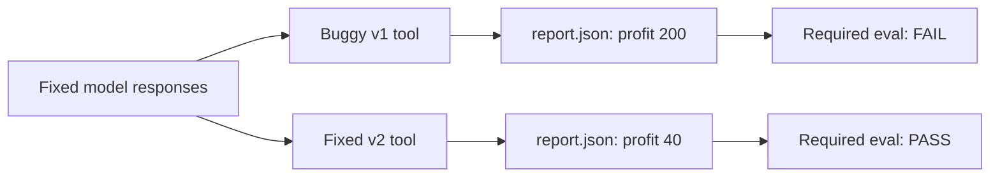

# From failed run to regression contract

The fastest way to understand Looplet's position is to run one small,
controlled proof.

```bash
git clone https://github.com/hsaghir/looplet
cd looplet
uv sync
uv run python examples/regression_demo/run_demo.py
```

No API key or network call is required.

```text
Looplet: one failed run -> one regression contract

1. CAPTURE v1 with fixed model responses
   model decisions: publish_report -> done
   collected profit: 200
   required eval: FAIL (0.00)

2. CHANGE one reviewable harness line
   - "profit": revenue + cost,
   + "profit": revenue - cost,

3. REPLAY captured responses with fresh v2 tool execution
   same decisions: true
   collected profit: 40
   required eval: PASS (1.00)
```

## What just happened

The demo uses one tiny report-agent cartridge. Its scripted model makes
exactly two decisions:

1. call `publish_report(revenue=120, cost=80)`;
2. call `done()`.

The v1 tool contains a bug: it calculates profit with addition. A
host-side collector reads the resulting `report.json`; it does not
trust the tool result or the agent's completion message. The required
grader compares that observed artifact with grader-only expected data
and fails.

Looplet records the model calls and trajectory. The v2 run then feeds
those **same captured responses** through a fresh tool registry whose
implementation subtracts cost. The collector reads a fresh file from a
fresh workspace, and the same grader passes.



## The evidence is ordinary files

The command prints its evidence directory. Inside it:

```text
looplet-regression-demo/
├── harness-v1.cartridge/
├── harness-v2.cartridge/
├── workspaces/
│   ├── v1/report.json
│   └── v2/report.json
└── runs/
    ├── v1/
    │   ├── manifest.jsonl
    │   ├── call_00_prompt.txt
    │   ├── call_00_response.txt
    │   ├── trajectory.json
    │   ├── artifacts.json
    │   ├── expected.json
    │   └── evals.json
    └── v2/
        ├── trajectory.json
        ├── artifacts.json
        ├── expected.json
        └── evals.json
```

Inspect the captured run:

```bash
uv run python -m looplet show /tmp/looplet-regression-demo/runs/v1
```

On macOS the default temporary path may be under `/var/folders`; use
`--out /tmp/looplet-regression-demo` when you want the exact path above.

Compare the generated harness versions:

```bash
uv run python -m looplet diff \
  /tmp/looplet-regression-demo/harness-v1.cartridge \
  /tmp/looplet-regression-demo/harness-v2.cartridge --show
```

## Three mechanisms, three jobs

| Mechanism | Holds or observes | Use it for |
| --- | --- | --- |
| Provenance capture | Actual prompts, responses, steps, stop reason | Explain a run and preserve model decisions |
| Captured-response replay | Model responses are fixed; harness execution is fresh | Isolate changes in tools, hooks, permissions, state, or loop code |
| Collectors + evals | Host-observed outcome and behavioral contract | Decide whether the resulting behavior is acceptable |

They are intentionally separate. A trace explains what happened. A
replay controls one source of variation. An eval decides whether the
outcome satisfies the contract.

## The honesty boundary

!!! warning "Replay is not deterministic simulation"
    Replay prevents another model call by returning captured model
    responses in order. Tools execute again. Filesystems, clocks,
    networks, random values, and external services remain live unless
    you isolate or mock them.

Captured-response replay is excellent for testing a tool or hook change
against the same model decisions. It cannot tell you whether a prompt
change would cause better decisions, because the responses are already
fixed. Test prompt or model changes with new sampled runs, repeated
trials where needed, and a holdout contract the candidate cannot edit.

## Adapt it to your agent

The shipped source is deliberately small:

- [`run_demo.py`](https://github.com/hsaghir/looplet/blob/master/examples/regression_demo/run_demo.py)
  wires capture, replay, and persistence.
- [`collect_outcome.py`](https://github.com/hsaghir/looplet/blob/master/examples/regression_demo/report_agent.cartridge/evals/collect_outcome.py)
  reads world state.
- [`eval_correctness.py`](https://github.com/hsaghir/looplet/blob/master/examples/regression_demo/report_agent.cartridge/evals/eval_correctness.py)
  defines required graders.
- [`profit_math.json`](https://github.com/hsaghir/looplet/blob/master/examples/regression_demo/report_agent.cartridge/evals/cases/profit_math.json)
  carries the task and grader-only expected result separately.

Replace the report collector with a test runner, database query, API
probe, schema check, or any other independent observation of success.
Keep quality assertions outcome-grounded; reserve trajectory assertions
for testing harness mechanics such as whether a permission hook fired.

[Learn provenance →](provenance.md){ .md-button }
[Write behavioral evals →](evals.md){ .md-button .md-button--primary }
