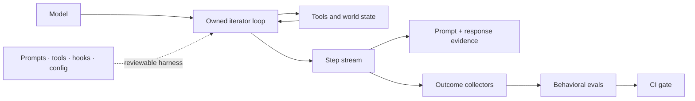

# Why looplet

An agent prototype is easy to start: send a prompt, expose tools, keep
calling the model until it stops. The hard part begins after the first
working demo.

A prompt edit fixes one case and breaks another. A tool changes its
side effects. A permission hook blocks a path you expected to work. A
model upgrade takes a different route. The question is no longer
**“Can this agent run?”** It is:

> **What behavior changed, and what evidence makes that change safe to ship?**

Looplet is a test-driven harness engineering toolkit for Python teams
that want to answer that question while still owning the loop.

## What “harness” means here

The model is one component. The **harness** is everything around it:

- the system prompt and task briefing;
- tool schemas and implementations;
- context, memory, and compaction policy;
- permissions, approvals, and stop conditions;
- the loop that connects model decisions to side effects;
- traces, outcome collectors, and behavioral evals.

Looplet keeps those concerns close to ordinary Python and reviewable
files instead of hiding them behind a graph runtime or hosted control
plane.



## The workflow

### 1. Own the execution boundary

`composable_loop()` is a generator. Every tool call becomes a `Step`
your code can inspect, print, save, route, or stop on.

```python
for step in composable_loop(llm=llm, tools=tools, hooks=hooks, task=task):
    print(step.pretty())
    if should_pause(step):
        break
```

There is no graph DSL between your code and the model/tool boundary.
Hooks are duck-typed Python objects, so behavior composes without a
framework class hierarchy.

### 2. Make the harness reviewable

A [cartridge](cartridge.md) stores the runnable harness as files:

```text
agent.cartridge/
├── cartridge.json
├── config.yaml
├── runtime.yaml
├── prompts/system.md
├── tools/<name>/{tool.yaml, execute.py}
├── hooks/<order>_<name>/{config.yaml, hook.py}
└── evals/{cases/, collect_*.py, eval_*.py}
```

`looplet describe`, `looplet diff`, and `looplet hash` make structural
changes explicit in code review. Cartridges are optional. The same
primitives work directly in Python, but cartridges provide a useful versioned
unit for teams and CI.

### 3. Preserve evidence

[Provenance capture](provenance.md) writes the prompts, responses,
steps, stop reason, and metadata to human-readable files. A captured
response stream can be replayed through fresh tools, hooks, state, and
permissions without paying for another model call.

That is **captured-response replay**, not deterministic simulation.
Model responses are held constant; tool code and side effects execute again.

### 4. Grade outcomes

[Collectors and evals](evals.md) let the host inspect the world after a
run by rerunning tests, reading an artifact, or inspecting a database, then grade
that evidence. The default is outcome-grounded:

```python
def collect_tests(state):
    result = subprocess.run(["pytest", "-q"], check=False)
    return {"tests_passing": result.returncode == 0}


@eval_mark("required")
def eval_tests_pass(ctx):
    return ctx.artifacts["tests_passing"]
```

The live task omits grader-only expected data. Discovered required graders,
collector errors, malformed records, and missing cases fail closed in the CLI.
Cartridge evals are still editable self-tests; protected promotion requires a
host-owned runner and an isolation boundary outside candidate authority.

## Where looplet fits

| If you need… | Reach for… |
| --- | --- |
| A few lines around one simple experiment | A raw Python loop |
| A single-loop agent whose harness must be inspectable and regression-tested | **Looplet** |
| Durable multi-stage workflows, branching graphs, and managed checkpoints | A graph/workflow runtime |
| Shared dashboards, annotation queues, and hosted experiment analytics | A hosted eval/observability platform |
| A turnkey coding assistant or research swarm | A batteries-included agent product |

Looplet can coexist with the other rows. It can run inside a durable
job, export traces to an observability service, or expose one agent as
a tool to another system. It does not try to absorb those systems into
its core.

## Good fit

Use Looplet when:

- your agent is fundamentally one model calling tools in a loop;
- your team already reviews Python, files, pytest, and CI;
- prompt, tool, hook, or model changes need behavioral evidence;
- you need exact interception points without subclassing a framework;
- local artifacts and zero required core dependencies matter.

## Not a good fit

Choose something else when:

- the product is naturally a branching graph with durable node-level
  scheduling;
- you want a hosted dashboard to be the source of truth;
- you need a prebuilt assistant more than a toolkit;
- you do not want to own the loop, tools, or test contract.

That boundary is deliberate. Looplet should make one loop unusually
easy to understand and change safely, not become a container for every
agent feature.

## See the claim run

The [failure-to-regression demo](regression-demo.md) is network-free and
executable. It captures a failing run, changes one tool line, replays
the same model decisions against fresh code, and turns an independent
world-state check from red to green.

[Run the proof →](regression-demo.md){ .md-button .md-button--primary }
[Start with your own loop →](quickstart.md){ .md-button }
